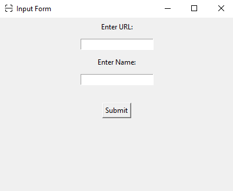

# QR Code Generator 


This Python program uses Tkinter and qrcode libraries to generate and display a QR code in a user-friendly GUI. The user inputs a URL and a name for the QR code, which is then generated and displayed in a new window. The user can save the QR code to their system


# Installation :-

<H2><span class="color-toggle">
Import the qrcode library for generating QR codes
</H2></span>

<H2>
Install all required module by :-
</H2>

```bash 
pip install qrcode,pillow,os-sys
```
[``qrcode``](https://pypi.org/project/qrcode/) module is imported for generating QR codes.   
``tkinter`` module is imported for creating a GUI.              
``filedialog`` module is imported from tkinter for displaying the file dialog box to select the folder.          
[``PIL``](https://pypi.org/project/Pillow/) (Python Imaging Library) is imported for handling images.          
[``os``](https://pypi.org/project/os-sys/) module is imported for interacting with the operating system.
```bash
import qrcode  
from tkinter import *
from tkinter import filedialog,messagebox
from PIL import ImageTk, Image
import os
```
<H2>
<span class="color-toggle">
Create a Tkinter window for user Input
</H2></span>

An instance of Tkinter ``Tk``
  class is created and assigned to the variable  ``root``
The window title is set to "Input Form"
The size of the window is set to 400x300 pixels
```bash
root = Tk()
root.title("Input Form")
root.geometry("400x300")
```
<H2><span class="color-toggle">Add an icon to GUI
</H2></span>


icon is set with ``iconbitmap``
```bash
root.iconbitmap("icon.ico")
```

<H2><span class="color-toggle">
Add labels and entry boxes for URL and Name input</H2></span>

Four instances of Tkinter ``Label`` and ``Entry`` classes are created to display and input the URL and name
```bash
label_url = Label(root, text="Enter URL:")
label_url.pack(pady=5)
input_url = Entry(root)
input_url.pack(pady=5)
label_name = Label(root, text="Enter Name:")
label_name.pack(pady=5)
input_name = Entry(root)
input_name.pack(pady=5)
```
<H2><span class="color-toggle">Define a function to get user Input
</H2></span>


A function `get_input()` is defined to get the input values from the user and assign them to global variables `user_input_url` and `user_input_name`
A button is created to submit the input values by calling the `get_input()` function
```bash
def get_input():
    global user_input_url,user_input_name
    user_input_url = input_url.get()
    user_input_name = input_name.get()
```
<H2><span class="color-toggle">If URL not given it will show message
</H2></span>
    
```bash
    if not user_input_url:
        messagebox.showerror("Error", "You have not given URL")
        return
```
<H2><span class="color-toggle">If name not given it will show message 
</H2></span>
  
```bash
    if not user_input_name:
        messagebox.showerror("Error", "You have not given name")
        return
    
```
<H2><span class="color-toggle">Print the URL and name</H2></span>

```bash
    print("User URL:   ", user_input_url  )
    print("User Name:  ", user_input_name  )
```
<H2><span class="color-toggle">To close the current GUI</H2></span>

```bash
    root.destroy()
```

<H2><span class="color-toggle">Add a button to submit user input</H2></span>


```bash
submit_button = Button(root, text="Submit", command=get_input)
submit_button.pack(pady=25)
```
<H2><span class="color-toggle">Run the Tkinter event loop to display the input window</H2></span>

```bash
root.mainloop()
```
<H2><span class="color-toggle">If name or url not given it will exit</H2></span>

```bash
if not user_input_url or not user_input_name:
    exit()
```
<H2><span class="color-toggle">Create a QR code using the qrcode library
</H2></span>


An instance of the ``QRCode`` class is created with version 1, box size 10, and border 5
The input URL is assigned to the variable ``data``
The ``add_data()`` method of the ``QRCode`` instance is called with data as an argument to add the input URL to the QR code
The ``make()`` method is called with `fit=True` to make the QR code fit the data
The ``make_image()`` method is called to generate the QR code as an image with black fill color and white background color
The generated image is saved as a PNG file named "qr_code.png"
```bash
qr = qrcode.QRCode(version=1, box_size=10, border=5)
data = user_input_url 
qr.add_data(data)
qr.make(fit=True)
```
This generates the QR code image with the specified colors and saves it as a PNG file named "qr_code.png"
```bash
img = qr.make_image(fill_color="black", back_color="white")
```

Save the QR code as a PNG file named "qr_code.png"
```bash
img.save("qr_code.png")
```
<H2><span class="color-toggle">Create a new Tkinter window to display the QR code
</H2></span>


A new instance of the `Tk` class is created for displaying the QR code, and assigned to the variable `root_qr`
The window title is set to the input name
The background color of the window is set to white
```bash
root_qr = Tk()
root_qr.title(f'{user_input_name}')
root_qr.config(bg="white")
```
Add an icon to GUI
```bash
root_qr.iconbitmap("icon.ico")
```
<H2><span class="color-toggle">Open the saved image and get its width and height
</H2></span>
This opens the QR code image file and gets its dimensions, and sets global variables for the width and height.
```bash
with Image.open("qr_code.png") as img:
    width, height = img.size
    global Width,Height
    Width=(width)
    Height=(height)
```

<H2><span class="color-toggle">Define a function to delete the saved image when the window is closed
</H2></span>


This defines a function to delete the QR code image file and close the window when the user closes the window.
```bash
def delete_file_on_close():
    os.remove("qr_code.png")
    root_qr.destroy()
```

<H2><span class="color-toggle">Define a function to prompt the user to select a directory to save the file
</H2></span>


``location`` defines a function to prompt the user to select a directory to save the QR code image, and then saves the image as a PNG file in that directory with the specified filename (user's input name + ".png"). It also renames the file from "qr_code.png" to the specified filename.
```bash
def location():
    desktop = os.path.join(os.path.join(os.environ['USERPROFILE']), 'Desktop')
    fi=filedialog.askdirectory(title="Where you want to save ?",initialdir=desktop)
    img.save(f'{fi}/qr_code.png')
```

<H2><span class="color-toggle">Rename the saved file to match the user input for the file name
</H2></span>

```bash
    current_file_name = "qr_code.png"
    file_name=user_input_name+".png"
    new_file_name = file_name
    directory_path = (f'{fi}/')
    file_path = os.path.join(directory_path, current_file_name)
    os.rename(file_path, os.path.join(directory_path, new_file_name))
```
<H2><span class="color-toggle">Display the image in a Label widget
</H2></span>


This opens the QR code image file and creates a PhotoImage object for displaying it in the window. It then creates a label with the image and adds a button to save the image using the location function.
```bash
img = Image.open("qr_code.png")
photo = ImageTk.PhotoImage(img)
label = Label(root_qr, image=photo, width=Width, height=Height,background="white")
label.pack()
```
<H2><span class="color-toggle">Button
</H2></span>

Add a button to prompt the user to select a directory to save the file
```bash
poke=Button(root_qr,text="save",borderwidth=0,font="20",bg="white",command=location,activebackground="white")
poke.pack(pady=10)
```

<H2><span class="color-toggle">Set a function to be called when the window is closed
</H2></span>


This sets the window protocol to call the delete_file_on_close function when the user closes the window.
```bash
root_qr.protocol("WM_DELETE_WINDOW", delete_file_on_close)
```

<H2><span class="color-toggle">Run the Tkinter event loop to display QR code
</H2></span>

This starts the main event loop for the window, which handles user interactions with the window and updates its display.
```bash
root_qr.mainloop()

```

## Author

- [@BhuvneshKing](https://www.github.com/BhuvneshKing)


## Badges

[](http://github.com/BhuvneshKing)


## Screenshots





